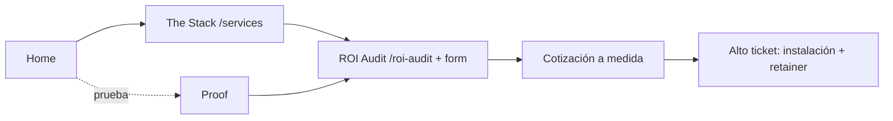
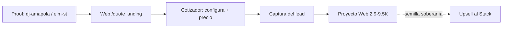
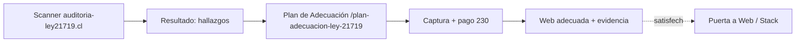

# Rutas de Conversión aglaya.biz — v1.0 (CERRADO 2026-06-11)

> **Estado:** ✅ CERRADO. Una ruta por tipo de visitante, alineada con la escalera
> (capa 3). Cada ruta: entrada → páginas → captura → siguiente peldaño.

---

## Ruta 1 — Empresa harta del alquiler (NÚCLEO, peldaño 3, el dinero)

**Quién:** negocio con operación real y presupuesto (techo EE.UU./global), harto de
SaaS/agencia, quiere poseer su infraestructura.

- **Entrada:** Home (posicionamiento) o búsqueda → The Stack.
- **Conversión clave:** el **form del ROI Audit** (no desviar a contact). Es la puerta al alto ticket.
- **Mensaje:** propiedad/soberanía + anclaje "coste de NO poseer". Garantía Sistema Conforme.
- **Proof** alimenta confianza en cualquier punto.

## Ruta 2 — Quiere una web propia (peldaño 2, entrada media, global)

**Quién:** alguien que necesita un sitio web que sea suyo (no Wix/WordPress alquilado).

- **Entrada:** el **proof de webs** (DJ Amapola, Elm St.) es el imán → enlaza a `/quote`.
- **Conversión:** cotizador (ya funciona) → captura.
- **Upsell:** "te entregamos en repo, es tuyo" planta la semilla → camino natural al Stack (peldaño 3).

## Ruta 3 — Cumplir la Ley 21.719 (peldaños 0-1, Chile, caja coyuntural)

> **Nota (2026-06-11):** esta ruta vive **íntegra en `auditoria-ley21719.cl`** (Scanner
> + Plan $230), NO en aglaya.biz. Se documenta aquí solo como cruce: un cliente
> satisfecho del Plan puede subir a Web/Stack en aglaya.biz más adelante.

**Quién:** negocio/profesional chileno con la ley encima. Urgencia REAL (deadline legal).

- **Entrada:** Scanner gratis (lead magnet, sitio aparte) → muestra fallos → CTA al Plan.
- **Conversión:** landing del Plan $230 → captura/pago.
- **Garantía:** si tras el Plan el Scanner no baja a verde, se repite gratis.
- **Puente:** cliente satisfecho del Plan = candidato a Web o Stack más adelante.

---

## Principios transversales

1. **Cada proof enlaza a su puerta** (no son páginas muertas): el proof de webs → /quote; el de Pulse/Outreach/Kanban → The Stack / ROI Audit.
2. **Una captura por intención** (detalle en capa 6): ROI Audit (núcleo), cotizador (web), Plan (Chile). No un único form genérico para todo.
3. **El proof es transversal:** alimenta confianza en las tres rutas.
4. **Regla de 3 clics:** desde Home, cualquier puerta a ≤3 clics.

## Huecos
- [ ] Confirmar que cada caso de `/proof` apunta a la puerta correcta (capa 5).
- [ ] Definir si el Scanner (sitio aparte) enlaza a la landing del Plan en aglaya.biz (§F del sitemap).
