# Flujos Post-Captura AGLAYA — v1.0 (CERRADO 2026-06-11)

> **Estado:** ✅ CERRADO. Qué dispara cada formulario tras el submit. Consolida lo
> que YA existe (CRM + 5 automatizaciones MailerLite) y lo mapea al diseño de captura
> de capa 6. Routing fino con defaults ajustables en ejecución.

---

## A. Arquitectura de dispatch (ya existe, se conserva)

Cada submit pasa por `contact.ts` / `quote.ts`:

```mermaid
flowchart TD
    F[Form submit] --> R["Resend (canario)<br/>notificación interna — AWAIT/bloqueante"]
    R -->|ok| P{Promise.allSettled<br/>best-effort, paralelo}
    P --> M["MailerLite<br/>grupo por segmento"]
    P --> C["CRM AGLAYA<br/>source=aglaya-form-*<br/>+ Idempotency-Key + GDPR"]
    R -->|falla| E[500 al usuario — gap visible]
```

- **Resend es el canario:** bloquea; si falla, el usuario ve 500 (notas el gap). MailerLite y CRM son best-effort (nunca rebotan al visitante).

## B. Mapa captura → CRM + MailerLite + secuencia

| Captura (capa 6) | CRM `source` | Grupo MailerLite (env var) | Secuencia |
|---|---|---|---|
| **ROI Audit — qualified** | `aglaya-form-qualified` | `MAILERLITE_CUALIFICADOS_GROUP_ID` | Bienvenida cualificado |
| **ROI Audit — borderline** | `aglaya-form-borderline` | `MAILERLITE_BORDERLINE_GROUP_ID` | Nurture borderline |
| **ROI Audit — no-fit / open-channel** | `aglaya-form-open-channel` | `MAILERLITE_NO_CUALIFICADOS_GROUP_ID` | Canal abierto / educativo |
| **Contacto simple** | `aglaya-website-form` | (¿NO_CUALIFICADOS o ninguno?) — ⚠️ §D | — |
| **Web / cotizador** | (¿source web?) — ⚠️ §D | `MAILERLITE_COTIZACIONES_GROUP_ID` | Seguimiento cotización |
| **Footer dispatch** (newsletter) | — (consent, no CRM) | `MAILERLITE_SUSCRIPCIONES_GROUP_ID` | Email 0 (la maneja MailerLite) |

**Base legal por flujo (contrato, capa 1/2):** ROI Audit / contacto / cotizador =
interés legítimo (acuse de lectura). Dispatch newsletter = consentimiento.

## C. Lo que ya está vs lo que falta

- **Ya activo:** las 5 automatizaciones MailerLite + dispatch CRM + Resend canario + Idempotency-Key (capa CRM cerrada hoy).
- **Falta confirmar:** que cada **nueva** captura del rediseño (ROI Audit gamificado, Web landing) apunte al grupo/source correcto cuando se construya (capa de ejecución).

## D. Defaults propuestos (ajustables en ejecución)

- **Contacto simple →** notificación interna (Resend) + CRM `source=aglaya-website-form`; **sin** secuencia agresiva (es contacto genérico, no un lead calificado).
- **Cotizador →** SÍ genera deal en CRM (es lead comercial real) + grupo `COTIZACIONES` + seguimiento.
- **Secuencias →** reutilizar las 5 actuales; crear nuevas solo si un segmento lo pide (diferido).

> Son ajustes de routing, no decisiones estratégicas. El fundador puede afinarlos al
> ejecutar las capas 5-6. No bloquean el cierre del blueprint.

Ver también: [`mailerlite-validation.md`](mailerlite-validation.md) — plan E2E (absorbe el pendiente #9).
