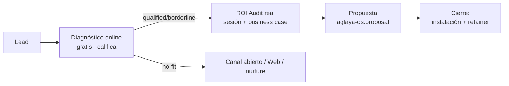

# Motor Comercial AGLAYA — v1.0 (CERRADO 2026-06-11)

> **Estado:** ✅ CERRADO. Funnel lead→cierre (máx 2 clientes núcleo). Arranque:
> Scanner (caja Chile inminente) + AGLAYA Outreach (primer producto tangible +
> motor outbound dogfooding). ROI Audit real de pago.

---

## A. El funnel de cierre (núcleo)

- **Capacidad real:** máx 2 clientes núcleo simultáneos (escasez, capa 2). El funnel
  no necesita volumen — necesita **2 cierres buenos**. Calidad > cantidad.

## B. El reto de arranque (capa 1): sin red, sin capital, sin portfolio

Cómo se llenan los primeros leads **sin presupuesto de publi**:

1. **Lead magnets que ya tienes:**
   - Scanner Ley 21.719 (Chile) → Plan $230 → cliente satisfecho → candidato a Web/Stack.
   - Diagnóstico online (gratis) → califica y captura.
2. **Proof como imán:** los 5 casos reales (Massiva, Bill Capital, Elm St., DJ Amapola, legal-reg-tech) son tu credibilidad. Cada uno empuja a su puerta (capa 4).
3. **Outreach proactivo** (`aglaya-os:outreach`): dado que no hay red, **outbound dirigido** al ICP (negocios hartos del alquiler SaaS). El propio AGLAYA Outreach (el producto) es la herramienta — *AGLAYA usa su producto para venderse* (dogfooding = prueba viviente).
4. **Contenido incómodo** (la voz de marca): posicionarse como "la agencia que confronta" genera atención orgánica sin gasto.

## C. Escalera comercial (junta las 3 líneas, capa 1/3)

| Entrada | Sube a |
|---|---|
| Scanner gratis (Chile) | Plan $230 → Web → Stack |
| Diagnóstico online | ROI Audit real → Stack |
| Proyecto Web ($2.9-9.5K) | Stack (la semilla "es tuyo, en repo" ya plantada) |

Cada cliente de un peldaño bajo es un lead caliente del siguiente. **El portfolio se
construye subiendo clientes de peldaño**, no esperando al cliente perfecto.

## D. Herramientas comerciales (a producir, aglaya-os)
- **Propuestas:** `aglaya-os:proposal` — plantilla de propuesta del Stack (instalación + retainer + adendas).
- **Outreach:** `aglaya-os:outreach` — secuencias outbound al ICP del núcleo.

## E. Decisiones de arranque — RESUELTAS (2026-06-11)

- [x] **ROI Audit real = DE PAGO** (ver roi-audit-offer.md §C).
- [x] **Prioridad de arranque:** dos motores reales y próximos —
  1. **Scanner Ley 21.719** — a punto de salir comercialmente. Caja Chile ya (Plan $230) + lead magnet.
  2. **AGLAYA Outreach** — el **primer producto tangible** de AGLAYA (en construcción intensiva). Es a la vez producto vendible Y el motor de outbound del propio AGLAYA (**dogfooding**: te vendes con lo que vendes).
  → El contenido incómodo (orgánico) queda como capa de marca de fondo, no como motor principal de arranque.
