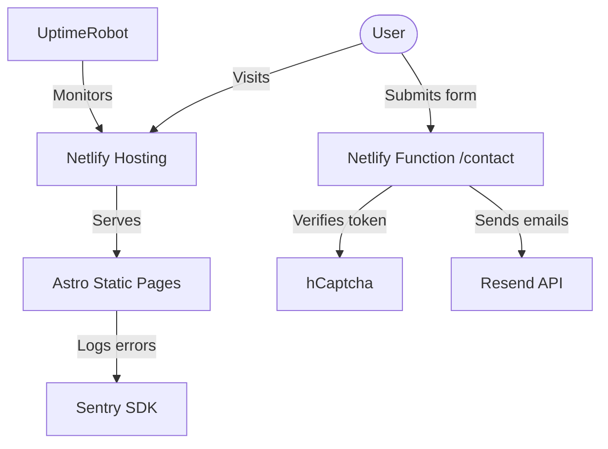

# AGLAYA — Architecture

## Infrastructure Overview



## Data Flow: Contact Form

1. User fills contact form (name, email, message) on `ContactForm.astro`.
2. hCaptcha widget generates a validation token client-side.
3. Form data + token + `lang` field is POSTed to `/.netlify/functions/contact`.
4. The serverless function:
   - Validates required fields (email format, non-empty message).
   - Calls hCaptcha API (`https://api.hcaptcha.com/siteverify`) with `HCAPTCHA_SECRET` to verify the token.
   - Detects the submission language (`lang: "en"` or `lang: "es"`).
   - If valid, calls Resend API to:
     - Send a branded confirmation email to the user in the submission language (EN or ES).
     - Send a lead notification email to `NOTIFY_EMAIL` with `[EN]` or `[ES]` tag in the subject.
5. Client receives JSON response and shows success/error message.

## Page Architecture

```
BaseLayout.astro
├── <head> — SEO meta, OG, Twitter, hreflang, JSON-LD, Sentry, Google Fonts
└── <body>
    ├── <slot /> — Page content
    │   ├── index.astro (EN)
    │   │   ├── Header (logo, WhatsApp CTA, language switcher)
    │   │   ├── Hero section (heading, coming soon label)
    │   │   ├── ContactForm.astro
    │   │   └── Marquee (service keywords)
    │   └── es/index.astro (ES) — same structure, Spanish translations
    └── CookieBanner.astro — fixed bottom, bilingual, localStorage-based consent
```

## i18n Strategy

- **Routing**: EN at `/`, ES at `/es/` (Astro built-in i18n with `prefixDefaultLocale: false`)
- **Translations**: Centralized in `src/i18n/translations.ts` with `useTranslations()` helper
- **SEO Parity**: hreflang links on every page, x-default points to EN

## Styling Architecture

- **Tailwind CSS v4** via Vite plugin (not PostCSS)
- **Design tokens** in `@theme` block of `global.css`
- **Fonts**: Outfit (display) + Inter (body) via Google Fonts with preconnect
- **Scoped styles** in `.astro` components for page-specific CSS

## Security Model

- hCaptcha bot protection on all forms (server-side token verification via `HCAPTCHA_SECRET`)
- Server-side validation in Netlify Functions
- CORS restricted to production domain
- Environment secrets never exposed to client
- Input sanitization (trim, lowercase, regex validation)
- `x-forwarded-for` parsed with `.split(",")[0].trim()` to handle Cloudflare proxy IP chains
