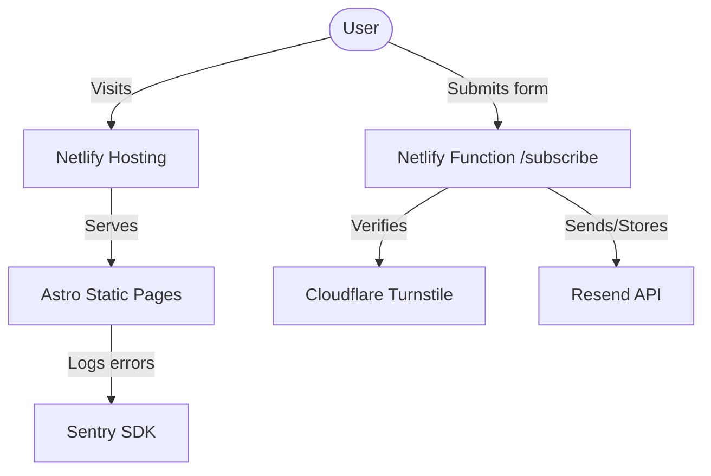

# AGLAYA v2 — Architecture

## Infrastructure Overview

## Data Flow: Lead Capture
1. User enters email in `LeadForm.astro`.
2. Cloudflare Turnstile widget generates a validation token client-side.
3. Form data (email + token) is POSTed to `/.netlify/functions/subscribe`.
4. The serverless function:
   - Validates the email format.
   - Calls Cloudflare API with the `TURNSTILE_SECRET` to verify the token.
   - If valid, calls Resend API to:
     - Add the email to a subscriber audience.
     - Send a confirmation email to the user.
     - Send a lead notification to `hola@aglaya.biz`.
5. Client receives success/error response and updates the UI.

## Performance & SEO
- **Images**: Local assets optimized via Astro's `Image` component.
- **i18n**: Subdirectory strategy (`/` for EN, `/es/` for ES) with full `hreflang` parity.
- **Accessibility**: ARIA-compliant forms and semantic HTML structure.
- **Error Tracking**: Global error boundary via Sentry snippets in `BaseLayout`.
