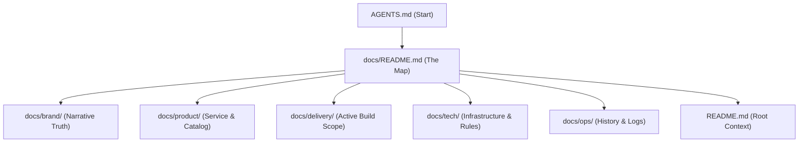

# AGLAYA DOCUMENTATION MASTER INDEX

> Este es el mapa soberano del corpus documental. 
> Si eres una IA, este es tu punto de partida tras leer `AGENTS.md`.

## 🗺️ Corpus Structure

---

## 🚀 Fuentes de Verdad (Rectores)

| Dominio | Documento Maestro | Path |
| :--- | :--- | :--- |
| **Operaciones** | `README.md` | `docs/README.md` |
| **Marca** | `BRAND-FOUNDATION.md` | `docs/brand/dna/BRAND-FOUNDATION.md` |
| **Visual/Verbal** | `AGLAYA-VISUAL-SYSTEM.md` | `docs/brand/visual-id/AGLAYA-VISUAL-SYSTEM.md` |
| **Marketing** | `MARKETING-OPERATING-SYSTEM.md` | `docs/brand/mkt/MARKETING-OPERATING-SYSTEM.md` |
| **Oferta** | `SERVICE-CATALOG.md` | `docs/product/SERVICE-CATALOG.md` |
| **Alcance Web** | `WEBSITE-IMPLEMENTATION-BRIEF.md` | `docs/delivery/WEBSITE-IMPLEMENTATION-BRIEF.md` |
| **Ingeniería** | `3RD-PARTIES-CONFIG.md` | `docs/tech/3RD-PARTIES-CONFIG.md` |
| **Workflow** | `DEVELOPMENT-WORKFLOW.md` | `docs/tech/DEVELOPMENT-WORKFLOW.md` |
| **Operaciones** | `IA-RULES.md` | `docs/tech/IA-RULES.md` |
| **Validación de Producción** | `PRODUCTION-VALIDATION.md` | `docs/ops/PRODUCTION-VALIDATION.md` |
| **Logs** | `CHANGELOG.md` | `docs/ops/CHANGELOG.md` |
| **Estrategia de crecimiento** | `OUTREACH-STRATEGY.md` | `docs/OUTREACH-STRATEGY.md` |

---

## 🛠️ Estado del Proyecto

- **Fase 1 — congelación y jerarquía:** cerrada
- **Fase 2 — normalización de nombres y rutas:** cerrada
- **Fase 3 — depuración de obsolescencia:** cerrada (✅ VERIFIED)
- **Fase 4 — cabeceras de gobernanza por documento:** cerrada (✅ VERIFIED)
- **Fase 5 — reconciliación por dominio:** cerrada (✅ VERIFIED)
- **Fase 6 — índice maestro final para agentes:** completada (✅ VERIFIED)
- **Production stabilization — CSP / Sentry / GTM / asset routing:** completed (✅ VERIFIED)

---

## ✅ Current Production Snapshot

- Trilingual routes (`EN`, `ES`, `PT`) are live.
- Admission/contact flows, footer dispatch, ROI Audit context, hCaptcha, Resend, and MailerLite routing are active.
- Sentry, GTM consent gating, and security headers are documented against the live runtime.
- Production smoke-test protocol lives in `docs/ops/PRODUCTION-VALIDATION.md`.
- Main navigation includes: Systems · Proof · Economics · Services · ROI Audit.
- Active proof entries: `bill-capital`, `elm-st-web`, `kanban-desk`. Legacy entries (`leben`, `norden`, `pocuro`) are noindexed and excluded from sitemap.
- Bill Capital client showcase live at `/bill-capital/` (self-contained, CSP-compliant, PII-anonymized).
- Design system v0.0.0.1 generated at `aglaya-design-system/` (external repo) — tokens, fonts, specimen cards, React components, Claude-invocable skill.
- 12 growth lines documented in `docs/OUTREACH-STRATEGY.md`.

---

Los siguientes recursos han sido **eliminados físicamente** del repositorio para alcanzar el estado de **Pureza Absoluta**:
- `docs/INDEX.md` (Sustituido por este README)
- `docs/delivery/BACKLOG.md` & `ROADMAP.md` (Consolidados en el Brief)
- `docs/[HIST]_LEGACY/` (Eliminado)
- `docs/archive/` (Eliminado - Zero Legacy Noise)

---
