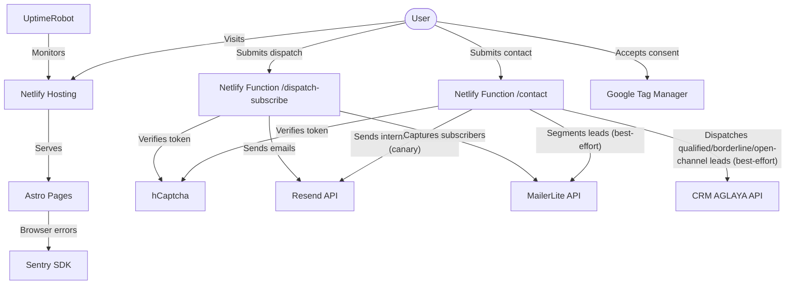

# AGLAYA — Architecture

## Infrastructure Overview



## Runtime Flows

### 1. Admission + Contact Flow

1. The user reaches the homepage or `/contact/`.
2. `ICPFilter.astro` evaluates:
   - manual execution percentage
   - existing data infrastructure
   - monthly growth investment
3. The user is routed into one of the live branches:
   - `QualifiedForm.astro`
   - `BorderlineForm.astro`
   - `OpenChannelForm.astro`
4. Each form:
   - requires explicit privacy consent
   - requires hCaptcha
   - submits to `/.netlify/functions/contact`
5. `contact.ts`:
   - validates payload
   - verifies hCaptcha
   - **canary**: `await sendInternalNotification(...)` — Resend → `info@aglaya.biz`. A Resend failure here returns `500` to the user (operator notices the gap between the form-submission email and the CRM panel).
   - **best-effort downstream syncs in parallel** via `Promise.allSettled`:
     - `syncContactToMailerLite(...)` — routes the lead to the correct MailerLite group when configured.
     - `dispatchLeadToCrm(...)` — POSTs to CRM AGLAYA's `/leads/capture` with the form-computed `lead_score` (0..100), `language`, and the source taxonomy `aglaya-form-{qualified,borderline,open-channel}`. Skipped silently if env vars are unset. Failures are captured in Sentry under `stage=crm-dispatch` with `crm_outcome:{anomaly,rejected,failed}` tags — they never bounce the visitor.

   Reconciliation while the CRM has no replay endpoint (tracked as INV-005 on the `crm-aglaya` side): the operator compares Resend internal emails against the CRM panel. If an email arrives but no deal appears, check Sentry for the `crm_outcome` tag and replay manually.

### 2. Footer Dispatch Flow

1. The footer renders `DispatchSignupForm.astro`.
2. The user submits:
   - first name
   - email
   - privacy consent
   - hCaptcha token
3. The client posts to `/.netlify/functions/dispatch-subscribe`.
4. `dispatch-subscribe.ts`:
   - validates consent and hCaptcha
   - captures the subscriber in MailerLite when configured
   - falls back to internal notification when MailerLite is unavailable
   - sends an immediate user-facing confirmation email via Resend

### 3. ROI Audit Context Flow

1. The user enters via `/roi-audit/`.
2. The CTA pushes context into the contact flow.
3. Hidden fields propagate:
   - `inquiry_type = ROI_AUDIT_LEAD`
   - `entry_point = roi_audit`
   - `service_interest = roi_audit`
4. `contact.ts` switches both internal and external copy to audit-specific messaging.

### 4. Analytics and Consent Flow

1. `window.dataLayer` is initialized in `BaseLayout.astro`.
2. GTM is **not** loaded by default.
3. `CookieBanner.astro` writes `aglaya_cookie_consent` to `localStorage`.
4. GTM loads only when consent is set to `all`.
5. UI flows dispatch measurement events through `window.dispatchEvent(new CustomEvent('aglaya:track', ...))`.

## Page Architecture

```
BaseLayout.astro
├── <head> — SEO meta, OG, Twitter, hreflang, JSON-LD, GTM gate, Sentry, Google Fonts
└── <body>
    ├── <slot /> — Page content
    │   ├── index.astro / es/index.astro / pt/index.astro
    │   ├── contact.astro / es/contact.astro / pt/contact.astro
    │   ├── roi-audit.astro + localized variants
    │   ├── proof routes + localized proof surfaces
    │   └── legal pages + localized variants
    ├── CookieBanner.astro — localStorage-based consent gate
    └── CustomCursor.astro
```

## i18n Strategy

- **Routing**: EN at `/`, ES at `/es/`, PT at `/pt/`
- **Implementation**: Astro i18n with `prefixDefaultLocale: false`
- **Translations**: centralized in `src/i18n/translations.ts`
- **SEO parity**: `hreflang` links emitted on every route via `BaseLayout.astro`

## Styling Architecture

- **Tailwind CSS v4** via Vite plugin (not PostCSS)
- **Design tokens** in `@theme` block of `global.css`
- **Fonts**: Outfit (display) + Inter (body) via Google Fonts with preconnect
- **Scoped styles** in `.astro` components for page-specific CSS

## Security Model

- hCaptcha on all active forms
- Explicit privacy-consent requirement on all active forms
- Server-side validation in Netlify Functions
- CORS restricted to the production origin
- environment secrets never exposed client-side unless intentionally public
- `public/_headers` is the security-header source of truth
- CSP, HSTS, anti-framing, permissions policy, and isolation headers are enforced at the CDN layer

## Observability Model

- **Browser**: `SentryBrowser.astro`
- **SSR**: `@sentry/astro` server integration
- **Functions**: `netlify/functions/_sentry.ts`
- **Analytics**: GTM gated behind cookie consent
- **Health monitoring**: UptimeRobot monitors public routes
- **CRM dispatch outcomes**: `contact.ts` tags each Sentry capture with `stage=crm-dispatch` + `crm_outcome:{anomaly|rejected|failed}` + `crm_status:<http-code>` + `crm_source:<funnel>`. Filter Sentry by `crm_outcome:anomaly OR crm_outcome:failed OR crm_outcome:rejected` to surface everything requiring human attention. The remaining outcomes (`created`, `excluded`, `skipped`) stay in structured logs only — they are expected steady-state behaviors, not errors.
